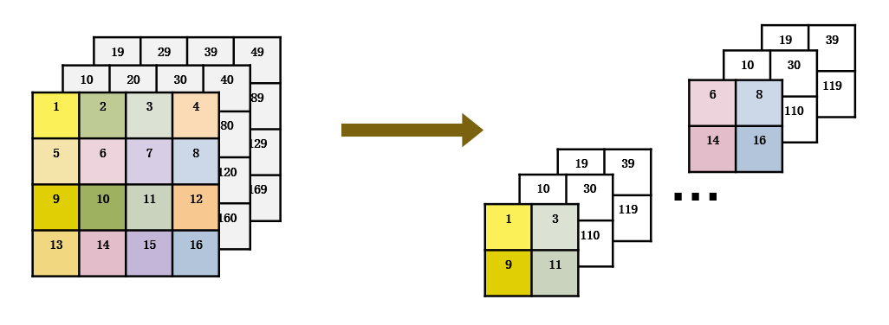

yolov5的fucos中 x(b,c,w,h) -> y(b,4c,w/2,h/2)，在很多设备上效率不高，直接改成卷积需要重新训练。

```python
class Focus(nn.Module):
    # Focus wh information into c-space
    def __init__(self, c1, c2, k=1, s=1, p=None, g=1, act=True):  # ch_in, ch_out, kernel, stride, padding, groups
        super().__init__()
        self.conv = Conv(c1 * 4, c2, k, s, p, g, act)

    def forward(self, x):  # x(b,c,w,h) -> y(b,4c,w/2,h/2)
        a = torch.cat([x[..., ::2, ::2], x[..., 1::2, ::2], x[..., ::2, 1::2], x[..., 1::2, 1::2]], 1)
        return self.conv(a)
```


可以直接把卷积的权重固定，这样可以直接替换
```python
class Focus(nn.Module):
    # Focus wh information into c-space
    def __init__(self, c1, c2, k=1, s=1, p=None, g=1, act=True):  # ch_in, ch_out, kernel, stride, padding, groups
        super().__init__()
        self.conv = Conv(c1 * 4, c2, k, s, p, g, act)

        weight = np.array(
            [
                [[1, 0, 0, 0],
                [0, 0, 0, 0],
                [0, 0, 0, 0]],
                [[0, 0, 0, 0],
                [1, 0, 0, 0],
                [0, 0, 0, 0]],
                [[0, 0, 0, 0],
                [0, 0, 0, 0],
                [1, 0, 0, 0]],

                [[0, 0, 1, 0],
                [0, 0, 0, 0],
                [0, 0, 0, 0]],
                [[0, 0, 0, 0],
                [0, 0, 1, 0],
                [0, 0, 0, 0]],
                [[0, 0, 0, 0],
                [0, 0, 0, 0],
                [0, 0, 1, 0]],

                [[0, 1, 0, 0],
                [0, 0, 0, 0],
                [0, 0, 0, 0]],
                [[0, 0, 0, 0],
                [0, 1, 0, 0],
                [0, 0, 0, 0]],
                [[0, 0, 0, 0],
                [0, 0, 0, 0],
                [0, 1, 0, 0]],

                [[0, 0, 0, 1],
                [0, 0, 0, 0],
                [0, 0, 0, 0]],
                [[0, 0, 0, 0],
                [0, 0, 0, 1],
                [0, 0, 0, 0]],
                [[0, 0, 0, 0],
                [0, 0, 0, 0],
                [0, 0, 0, 1]],
            ]
        )

        weight = weight.reshape(12, 3, 2, 2)
        weight = torch.from_numpy(weight).type(torch.FloatTensor)

        self.conv0 = nn.Conv2d(3, 12, (2, 2), (2, 2), bias=False)
        self.conv0.weight.data = weight
    
    def forward(self, x):  # x(b,c,w,h) -> y(b,4c,w/2,h/2)
        a = self.conv0(x)
        return self.conv(a)

```